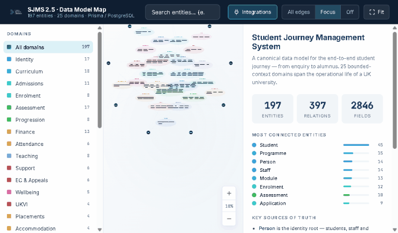
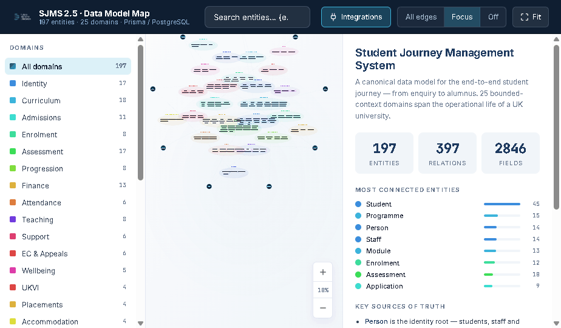
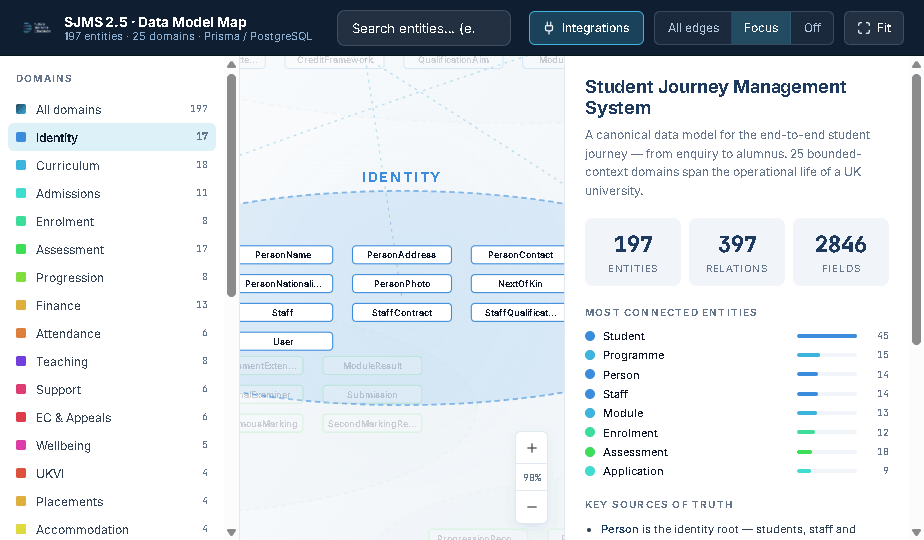
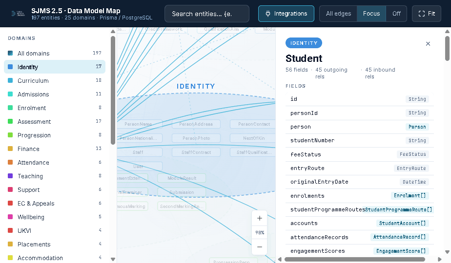
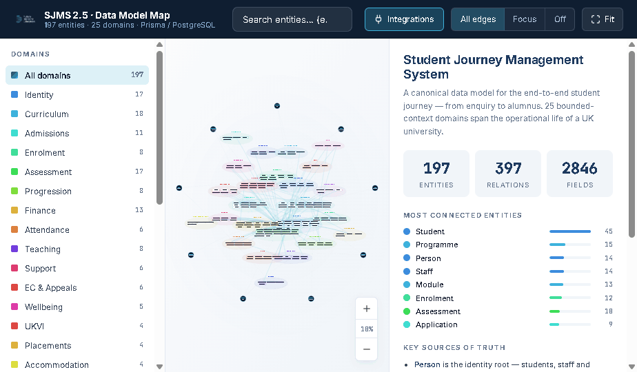

# Higher Education Data Model

**An interactive map of the complete student-journey data model for UK higher education.**

197 entities · 397 relationships · 25 bounded-context domains. Built for the [SJMS 2.5](#about-the-project) (Student Journey Management System) reference architecture by [Future Horizons Education](https://futurehorizonseducation.com).

### 🔎 [Launch the interactive map →](https://future-horizons-education.github.io/Higher-Education-Data-Model/)



---

## What is this?

A **canonical data model** for everything that happens to a student in a UK university — from the moment a prospect submits an enquiry, through admissions, enrolment, teaching, assessment, progression, support, finance, graduation, and on to the alumni record. The model captures not just the obvious operational entities (Student, Programme, Module, Assessment) but also the full regulatory and pastoral apparatus that universities must maintain: HESA Data Futures returns, UKVI tier-4 sponsorship, extenuating circumstances, disability support, placements, accommodation, governance committees, and more.

The interactive map lets you:

- **See the whole system at once** — a radial cluster layout groups the 197 entities into 25 colour-coded domains
- **Click any entity** to open a detail panel showing every field (with types) and every inbound/outbound relation
- **Trace cross-domain links** — when `Student` is selected, the map lights up its 90+ connections across finance, attendance, assessment, accommodation, HESA, and more
- **Focus a domain** — click a domain in the sidebar to isolate its cluster and see only the relations that cross its boundary
- **Search** any of the 197 entity names
- **Toggle integrations** to see how external systems (Keycloak, UCAS, HESA/OfS, UKVI SMS, Moodle, Stripe, n8n, Sage/Xero, SLC) connect to each domain

Every edge in the map is sourced directly from a Prisma/PostgreSQL `schema.prisma` — nothing is invented or approximated.

---

## The 25 domains

The data model is organised into bounded contexts, each owning a coherent slice of the student journey:

| # | Domain | Entities | What lives here |
|---|--------|---------:|-----------------|
| 1 | **Identity & Person** | 17 | `Person` as the identity root, with `Student`, `Staff`, `Applicant`, `User`, and all contact / demographic / nationality attributes |
| 2 | **Curriculum** | 18 | `Faculty → School → Department → Programme → Module`, with specifications, pathways, accreditation, learning outcomes |
| 3 | **Admissions** | 11 | `Application`, offers, conditions, interviews, UCAS choices, agents, open-day attendance |
| 4 | **Enrolment & Registration** | 8 | `Enrolment`, module registration, fee assessment, per-session status history |
| 5 | **Assessment & Marks** | 17 | `Assessment → Submission → MarkEntry → ModuleResult`, exam boards, moderation, second marking, external examiners |
| 6 | **Progression & Awards** | 8 | Progression decisions, classification rules, degree calculation, transcripts, diploma supplements |
| 7 | **Student Finance** | 13 | `StudentAccount → ChargeLine / Invoice / Payment`, payment plans, sponsors, bursaries, refunds, credit notes |
| 8 | **Attendance & Engagement** | 6 | `AttendanceRecord`, engagement scores, intervention workflow, at-risk alerts, targets |
| 9 | **Teaching & Timetable** | 8 | `TeachingEvent`, rooms, timetable slots, clash detection, teaching groups, staff availability |
| 10 | **Student Support** | 6 | Tickets, interactions, personal tutoring, referrals, flags, actions |
| 11 | **EC & Appeals** | 6 | Extenuating circumstances, appeals, plagiarism, disciplinary, fitness-to-study, complaints |
| 12 | **Disability & Wellbeing** | 5 | Disability records, reasonable adjustments, wellbeing, mental-health, accessibility |
| 13 | **UKVI & Compliance** | 4 | Tier-4 sponsorship, CAS numbers, Home Office contact points, attendance monitoring, SMS reporting |
| 14 | **Placements** | 4 | Providers, placement records, visits, on-placement assessment |
| 15 | **Accommodation** | 4 | Halls, rooms, bookings, applications |
| 16 | **Graduation & Ceremonies** | 4 | Ceremonies, registration, certificate issue, alumni transition |
| 17 | **Change of Circumstances** | 3 | `ChangeOfCircumstances`, interruptions, withdrawals |
| 18 | **Document Management** | 5 | Documents, verification, letter templates, generated letters, template variables |
| 19 | **Communications** | 4 | Communication templates, logs, bulk communications, notification preferences |
| 20 | **HESA & Statutory Reporting** | 7 | HESA returns, notifications, snapshots, validation rules, Data Futures entities |
| 21 | **HESA / Finance / GDPR (Phase 4)** | 11 | HESA Data Futures student/module records, financial ledger, data classification |
| 22 | **Governance** | 5 | Committees, meetings, members, agenda items, policy documents |
| 23 | **Audit & System** | 9 | Audit log, system settings, notifications, user sessions, webhooks, workflow errors, DP requests, consent |
| 24 | **Calendar & Academic Year** | 4 | Academic calendar, year, term dates, teaching weeks |
| 25 | **Reference Data** | 10 | Countries, institutions, qualifications, grade scales, HECoS/JACS codes, UCAS tariff, groups |

---

## The core spines

Three backbones run through the model. Understanding these gives you the rest of the map for free.

### The academic spine

```
Person → Student → Enrolment → ModuleRegistration → Assessment → Submission → MarkEntry → ModuleResult → ProgressionRecord → AwardRecord → Transcript
```

Every academic fact about a student is anchored to this chain. `Enrolment` is the per-year registration; `ModuleRegistration` is the per-module join; `Assessment` is the assessed piece of work; `ModuleResult` is the final capped mark that flows into progression decisions.

### The finance spine

```
Student → StudentAccount → ChargeLine / Invoice → Payment / PaymentPlan → (Sage / Xero ledger mirror)
```

`StudentAccount` is the per-student ledger. `ChargeLine` is what the institution bills for (tuition, accommodation, bursary offsets). `Payment` is what actually lands. `PaymentPlan → PaymentInstalment` handles deferred-payment obligations. Everything mirrors to the external finance system so the institutional ledger stays authoritative.

### The compliance spine

```
Student → HESAStudent → HESAStudentModule / HESAEntryQualification → HESAReturn → StatutoryReturnRun → HESA/OfS
```

The `HESA*` entities are **snapshots**, not live links — they capture the state the institution will stand behind for the annual Data Futures return. `HESAValidationRule` encodes the validation logic; `HESANotification` tracks exchanges with HESA; `StatutoryReturnRun` records each actual submission.

---

## Screenshots

**Overview — all 197 entities, 25 domains, every relation**


**Identity cluster isolated**


**`Student` entity selected — 45 outgoing, 45 inbound relations across 20+ domains**


**All edges on with external integrations overlaid**


---

## About the project

**SJMS 2.5 — Student Journey Management System** is a reference architecture for a modern UK HE student record system. It is designed around a few principles:

- **Person-as-root identity.** A single `Person` entity underpins `Student`, `Staff`, `Applicant`, and `User`, so a prospect who becomes a student who returns as a tutor is one continuous identity across the institution.
- **Bounded contexts.** The 25 domains are owned by different operational teams and can be developed and scaled independently.
- **Snapshot-based statutory reporting.** HESA/OfS submissions are derived from frozen snapshots (`HESAStudent`, `HESASnapshot`, etc.) rather than live joins, so a submission is reproducible a year later even as the live record changes.
- **Audit-everything.** Every mutating operation writes to `AuditLog`; PII reads are gated through `ConsentRecord` / `DataProtectionRequest`.
- **External-system-friendly.** Integrations (UCAS, SLC, HESA, UKVI, Moodle, Stripe, Keycloak, n8n, Sage/Xero) are first-class citizens in the model — the integration map on the overview view shows how each external system touches the domains.

The full schema is Prisma + PostgreSQL. 197 models, ~2,850 fields, 397 relations.

---

## Using this for your own work

Public feedback welcome — whether you're:

- **Building a student record system** and want a starting point for your own domain model
- **Specifying a procurement** and need a checklist of entities a modern SRS should cover
- **Working in UK HE data / IR / student systems** and want to compare your mental model against ours
- **Teaching data modelling** and want a real, large-scale, domain-rich example to pick apart

Open an issue, drop a comment on [the LinkedIn post][linkedin], or [reach out directly](https://futurehorizonseducation.com/contact).

---

## Tech notes

- **Frontend.** Single-page React 18 + Babel-standalone, no build step. Vanilla SVG for the map (no D3).
- **Layout.** Custom radial cluster with primary/secondary/tertiary rings sized by domain weight; within each cluster, entities pack into a grid.
- **Data.** The map reads `schema.prisma` directly, extracted into a `model-map.json` with fields, types, and relations preserved. No code generation / ORM round-trip needed.
- **Hosting.** The whole thing is a single self-contained HTML file (~1.8 MB inlined assets) served from GitHub Pages. No backend, no CDN dependencies at runtime.

If you want to regenerate the map from an updated schema, the extraction logic lives in the source project — get in touch.

---

## Credits

Built by [Future Horizons Education](https://futurehorizonseducation.com).

[linkedin]: # "LinkedIn post URL — add when published"

<!--
  Live URL:  https://future-horizons-education.github.io/Higher-Education-Data-Model/
  Repo:      https://github.com/Future-Horizons-Education/Higher-Education-Data-Model
-->
